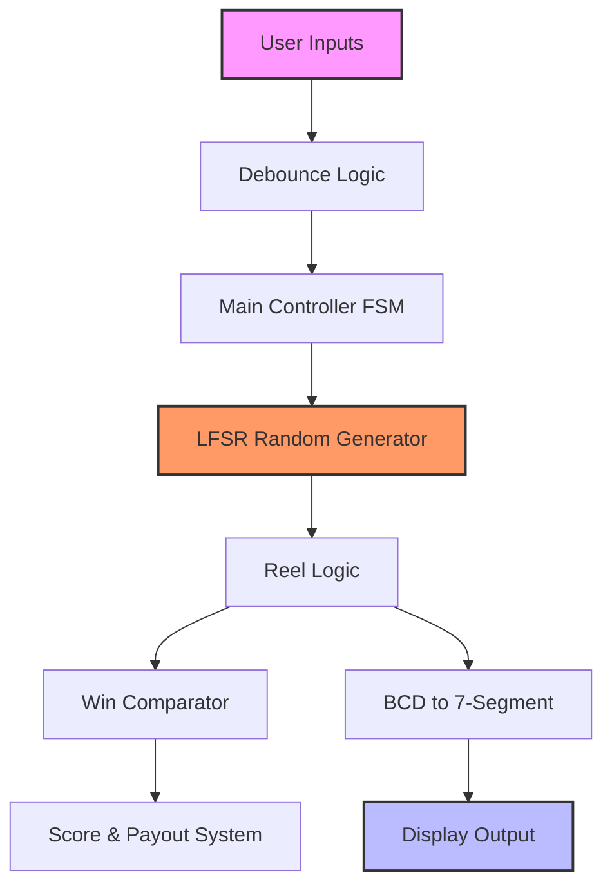
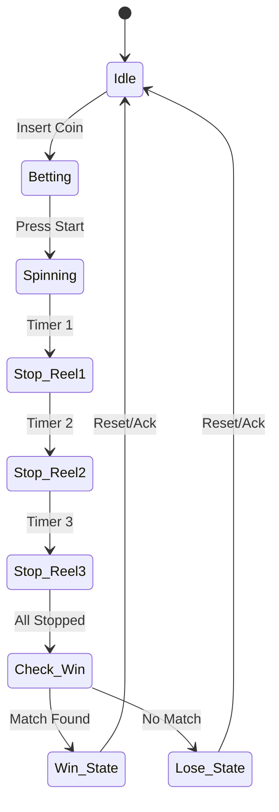
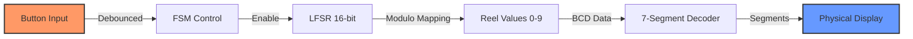

<div align="center">

# Slot Machine Simulation - FPGA Based Game System

🎰 A sophisticated VHDL-based digital implementation of a casino-style Slot Machine, featuring Pseudo-Random Number Generation (LFSR) and Finite State Machine logic.

## Tech Stack
[](#)
[](#)
[](#)

## Team Members
**Muhammad Rafif Batubara** - 2406436253  
**Radya Gardian Pranoto** - 2406404592  
**Diandra Pramesti Wicaksono** - 2406342360  
**Ayesha Zelene Faeyza** - 2406359166

---
</div>

## System Overview

This project implements a fully functional Slot Machine simulation on an FPGA. The core of the system relies on a **Linear Feedback Shift Register (LFSR)** to generate random sequences for the reels and a **Finite State Machine (FSM)** to manage the game flow (betting, spinning, stopping, and win checking).



## Key Features
- 🎲 Pseudo-Random Number Generation: Uses 16-bit LFSR for unpredictable reel outcomes.
- 🔄 FSM Control: Robust state machine handling game states (Idle, Spin, Stop, Win).
- 📺 Visual Output: Multiplexed 7-Segment display driver for reel values and score.
- 💰 Betting System: Logic to handle coin input, betting multipliers, and jackpot calculation.
- ⏱️ Adjustable Speed: Clock division for realistic spinning animation.
  
  
## System Architecture
### Control Flow (FSM)



### Random Number Generator (LFSR) Implementation
The system replaces standard software randomization with a hardware-based Linear Feedback Shift Register using maximal length taps.

```m
-- LFSR Process for Randomness
process(clk, reset)
begin
    if reset = '1' then
        lfsr_reg <= (others => '1'); -- Non-zero seed
    elsif rising_edge(clk) then
        -- Taps at bits 16, 14, 13, 11 for maximal length sequence
        feedback := lfsr_reg(15) XOR lfsr_reg(13) XOR lfsr_reg(12) XOR lfsr_reg(10);
        lfsr_reg <= lfsr_reg(14 downto 0) & feedback;
    end if;
end process;
```

### Win Check Algorithm
The comparator block evaluates the stopped reels to determine the payout multiplier:

```m
-- Win Logic 
if (reel1 = reel2) and (reel2 = reel3) then
    is_win <= '1';
    if reel1 = "0111" then -- Lucky 7s (Jackpot)
        payout_multiplier <= "1111"; 
    else
        payout_multiplier <= "0011"; -- Standard Win
    end if;
else
    is_win <= '0';
end if;
```

## Technical Specifications
* System Clock: 50MHz (DE1-SoC / DE2 Standard)
* Animation Clock: ~15Hz (Divided for visual effect)
* Randomness: 16-bit LFSR (Period: 65,535 cycles)
* Display: 6-Digit 7-Segment (Multiplexed)
* Data Width: 4-bit per Reel (BCD encoding)

## Signal Processing



## Components
* Top_Level_SlotMachine: Main entity connecting all modules.
* Controller_FSM: State machine logic for game rules.
* LFSR_Random: Random number generator entity.
* Clock_Divider: Frequency scaler for human-visible animation.
* Seven_Segment_Driver: Decodes BCD values to 7-segment patterns.

## Setup and Usage
This project is designed for simulation-based verification. No physical FPGA hardware is required.

* Prerequisites
ModelSim (Intel FPGA Starter Edition or Standard) or QuestaSim.
(Optional) Quartus Prime for code editing and syntax checking.

* How to Run Simulation
Step 1: Launch ModelSim.
Step 2: Create a new project (File > New > Project) and name it SlotMachine_Sim.
Step 3: Add all VHDL files from the RTL/ folder to the project.
Step 4: Compile all files (Compile > Compile All). Ensure there are no errors.
Step 5: Load the simulation:
Go to the Library tab.
Expand the work library.
Right-click on the Testbench file (e.g., tb_slotmachine) and select Simulate.
Step 6: Add signals to the Waveform:
Right-click on the instance in the Sim tab -> Add to -> Wave.
Step 7: Run the simulation:
Type run 1000 ms in the transcript or click the Run button.

## File Structure
```
└── Finpro_PSD_16/
    ├── RTL Synthesis From Quartus/
    │   ├── SlotMachine_Advanced.qpf    # Quartus Prime Project File
    │   └── SlotMachine_Advanced.qsf    # Quartus Settings File
    ├── VHDL_CODE/
    │   ├── SlotMachine_Advanced.vhd    # Main System Entity & Logic
    │   └── tb_SlotMachine.vhd          # Testbench for Simulation
    ├── Documentation/
    │   ├── Laporan_Akhir_PSD.pdf       # Full Project Report
    │   └── Presentasi_Final_Project.pptx # Presentation Slides
    ├── .gitignore                      # Git Ignore Rules
    └── README.md                       # Project Documentation
```

## Performance Characteristics
* Response Time: Instantaneous simulation response.
* Random Distribution: Verified uniform distribution over 16-bit space via waveform analysis.
* Stability: Synchronous design with proper reset handling.

## Safety Features
* Illegal State Recovery: FSM defaults to Idle on unknown states.
* Bet Limiter: Logic prevents betting more than available credits during simulation.

## Contributing
This project is part of a PSD (Digital System Design) final project. Contributions and improvements are welcome through pull requests.

## License
This project is available for educational and research purposes. Please refer to the included documentation for more details.